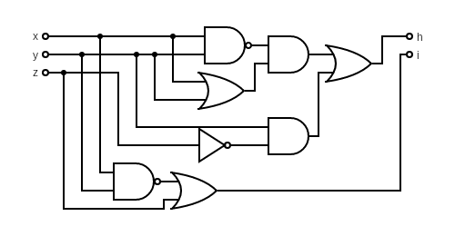

# Praktikum 1: Digitaler Würfel

## Aufgabe 1
- a)

  | Augenzahl | iputs | L1 | L2 | L3 | L4 | L5 | L6 | L7 |
  | -         | -     | -  | -  | -  | -  | -  | -  | -  |
  | 0         | 0 0 0 | 0  | 0  | 0  | 0  | 0  | 0  | 0  |
  | 1         | 0 0 1 | 0  | 0  | 0  | 0  | 0  | 0  | 1  |
  | 2         | 0 1 0 | 1  | 0  | 0  | 0  | 0  | 1  | 0  |
  | 3         | 0 1 1 | 1  | 0  | 0  | 0  | 0  | 1  | 1  |
  | 4         | 1 0 0 | 1  | 0  | 1  | 1  | 0  | 1  | 0  |
  | 5         | 1 0 1 | 1  | 0  | 1  | 1  | 0  | 1  | 1  |
  | 6         | 1 1 0 | 1  | 1  | 1  | 1  | 1  | 1  | 0  |
  | 7         | 1 1 1 | 1  | 1  | 1  | 1  | 1  | 1  | 1  |

- b)

  ```
  L1 = ((!b2 & b1 & !b0) # (!b2 & b1 & b0)) # ((b2 & !b1 & !b0) # (b2 & !b1 & b0)) # ((b2 & b1 & !b0) # (b2 & b1 & b0)) | Distributivgesetz (!b2 & b1), (b2 & !b1), (b2 & b1)
    = ((!b2 & b1) & (!b0 # b0)) # ((b2 & !b1) & (!b0 # b0)) # ((b2 & b1) & (!b0 # b0)) | Konstantes Element
    = ((!b2 & b1) & 1) # ((b2 & !b1) & 1) # ((b2 & b1) & 1) | Neutrales Element
    = (!b2 & b1) # (b2 & !b1) # (b2 & b1) | Distributivgesetz
    = (!b2 & b1) # (b2 & (!b1 # b1)) | Konstante Element
    = (!b2 & b1) # (b2 & 1) | Neutrales Element
    = (!b2 & b1) # b2 | Distributivgesetz
    = (!b2 # b2) & (!b1 # b2) | Konstantes Element
    = 1 & (!b1 # b2) | Neutrales Element

    = !b1 # b2
  ```
  ```
  L2 = (b2 & b1 & !b0) # (b2 & b1 & b0) | Distributivgesetz (b2 & b1)
    = (b2 & b1) & (!b0 # b0) | Konstantes Element kürzen
    = (b2 & b1) & 1

    = b2 & b1
  ```
  ```
  L3 = ((b2 & !b1 & !b0) # (b2 & !b1 & b0)) # ((b2 & b1 & !b0) # (b2 & b1 & b0)) | Distributivgesetz (b2 & !b1), (b2 & b1)
    = ((b2 & !b1) & (!b0 # b0)) # ((b2 & b1) & (!b0 # b0)) | Konstantes Element kürzen
    = (b2 & !b1) # (b2 & b1) | Distributivgesetz
    = b2 & (!b1 # b1) | Konstantes Element kürzen
    = b2 & 1 | Neutrale Element

    = b2
  ```
  ```
  L4 = (b2 & !b1 & !b0) # (b2 & !b1 & b0) # (b2 & b1 & !b0) # (b2 & b1 & b0)  | Distributivgesetz (b2 & !b1), (b2 & b1)
    = ((b2 & !b1) & (!b0 # b0)) # ((b2 & b1) & (!b0 # b0)) | Konstantes Element kürzen
    = (b2 & !b1) # (b2 & b1) | Distributivgesetz
    = b2 & (!b1 # b1) | Konstantes Element kürzen
    = b2 & 1 | Neutrale Element

    = b2
  ```
  ```
  L5 = (b2 & b1 & !b0) # (b2 & b1 & b0) | Distributivgesetz (b2 & b1)
    = (b2 & b1) & (!b0 # b0) | Konstantes Element kürzen
    = (b2 & b1) & 1

    = b2 & b1
  ```
  ```
  L6 = ((!b2 & b1 & !b0) # (!b2 & b1 & b0)) # ((b2 & !b1 & !b0) # (b2 & !b1 & b0)) # ((b2 & b1 & !b0) # (b2 & b1 & b0)) | Distributivgesetz (!b2 & b1), (b2 & !b1), (b2 & b1)
    = ((!b2 & b1) & (!b0 # b0)) # ((b2 & !b1) & (!b0 # b0)) # ((b2 & b1) & (!b0 # b0)) | Konstantes Element
    = ((!b2 & b1) & 1) # ((b2 & !b1) & 1) # ((b2 & b1) & 1) | Neutrales Element
    = (!b2 & b1) # (b2 & !b1) # (b2 & b1) | Distributivgesetz
    = (!b2 & b1) # (b2 & (!b1 # b1)) | Konstante Element
    = (!b2 & b1) # (b2 & 1) | Neutrales Element
    = (!b2 & b1) # b2 | Distributivgesetz
    = (!b2 # b2) & (!b1 # b2) | Konstantes Element
    = 1 & (!b1 # b2) | Neutrales Element

    = !b1 # b2
  ```
  ```
  L7 = ((!b2 & !b1 & b0) # (!b2 & b1 & b0)) # ((b2 & !b1 & b0) # (b2 & b1 & b0)) | Distributivgesetz b0
    = (b0 & ((!b2 & !b1) # (!b2 & b1))) # (b0 & ((b2 & !b1) # (b2 & b1))) | Distributivgesetz !b2, b2
    = (b0 & (!b2 & (!b1 # b1))) # (b0 & (b2 & (!b1 # b1))) | Konstantes Element
    = (b0 & (!b2 & 1)) # (b0 & (b2 & 1)) | Neutrales Element
    = (b0 & !b2) # (b0 & b2) | Distributivgesetz
    = b0 & (!b2 # b2) | Konstantes Element
    = b0 & 1 | Neutrales Element

    = b0
  ```

## Aufgabe 2

- a) ✔️

- b) ✔️

- c)

  `L1 = b1 # b2`

  `L2 = b1 & b2`

  `L3 = b2`

  `L4 = b2`

  `L5 = b1 & b2`

  `L6 = b1 # b2`

  `L7 = b0`

  `L4 == L3`

  `L5 == L2`

  `L6 == L1`

- d) nein

## Aufgabe 3

- a)

  **h und i sind im Bild vertauscht**

  

  ```
  h = (!x & y) # (x & !y) # (y & !z) | Distributivität

  => h = ((!x # (x & !y)) & (y # (x & !y))) # (y & !z) | Distributivität

  => h = (((!x # x) & (!x # !y)) & ((y # x) & (y # !y))) # (y & !z) | Konstantes und Neutrales Element

  => h = ((!x # !y) & (x # y)) # (y & !z) | DeMorgan

  => h = (!(x & y) & (x # y)) # (y & !z)
  ```

  ```
  i = (!x & z) # (!y & z) | Distributivität

  => i = z & (!x # !y) | DeMorgan

  => i = z & !(x & y)
  ```

## Aufgabe 4

| Bedeutung | enable | test | b2 | b1 | b0 | L1 | L2 | L3 | L7 |
| -         | -      | -    | -  | -  | -  | -  | -  | -  | -  |
| disabled  | 0      | x    | x  | x  | x  | 0  | 0  | 0  | 0  |
| test      | 1      | 1    | x  | x  | x  | 1  | 1  | 1  | 1  |
| 0         | 1      | 0    | 0  | 0  | 0  | 0  | 0  | 0  | 0  |
| 1         | 1      | 0    | 0  | 0  | 1  | 0  | 0  | 0  | 1  |
| 2         | 1      | 0    | 0  | 1  | 0  | 1  | 0  | 0  | 0  |
| 3         | 1      | 0    | 0  | 1  | 1  | 1  | 0  | 0  | 1  |
| 4         | 1      | 0    | 1  | 0  | 0  | 1  | 0  | 1  | 0  |
| 5         | 1      | 0    | 1  | 0  | 1  | 1  | 0  | 1  | 1  |
| 6         | 1      | 0    | 1  | 1  | 0  | 1  | 1  | 1  | 0  |
| 7         | 1      | 0    | 1  | 1  | 1  | 1  | 1  | 1  | 1  |

- a)

  ```
  L1 = (en & t) # (en & !t & !b2 & b1 & !b0) # (en & !t & !b2 & b1 & b0) # (en & !t & b2 & !b1 & !b0) # (en & !t & b2 & !b1 & b0) # (en & !t & b2 & b1 & !b0) # (en & !t & b2 & b1 & b0) | Distributivgesetz
    = (en & t) # (en & !t) & ((!b2 & b1 & !b0) # (!b2 & b1 & b0) # (b2 & !b1 & !b0) # (b2 & !b1 & b0) # (b2 & b1 & !b0) # (b2 & b1 & b0)) | Distributivgesetz
    = (en & t) # (en & !t) & (!b0 & ((!b2 & b1) # (b2 & !b1) # (b2 & b1)) # b0 & ((!b2 & b1) # (b2 & !b1) # (b2 & b1))) | Distributivgesetz
    = en & (t # !t) & (((!b2 & b1) # (b2 & !b1) # (b2 & b1)) & (b0 # !b0)) | Konstantes und Neutrales Element
    = en & ((!b2 & b1) # (b2 & !b1) # (b2 & b1)) | Distributivgesetz
    = en & ((!b2 & b1) # b2 & (!b1 # b1)) | Konstantes und Neutrales Element
    = en & ((!b2 & b1) # b2) | Distributivgesetz
    = en & ((!b2 # b2) & (!b2 # b1)) | Konstantes und Neutrales Element

    = en & (!b2 # b1)
  ```

  ```
  L2 = (en & t) # (en & !t & b2 & b1 & !b0) # (en & !t & b2 & b1 & b0) | Distributivgesetz
    = (en & t) # (en & !t) & ((b2 & b1 & !b0) # (b2 & b1 & b0)) | Distributivgesetz
    = en & (t # !t) & ((b2 & b1) # (!b0 & b0)) | Konstantes und Neutrales Element

    = en & (b2 & b1)
  ```

  ```
  L3 = (en & t) # (en & !t & b2 & !b1 & !b0) # (en & !t & b2 & !b1 & b0) # (en & !t & b2 & b1 & !b0) # (en & !t & b2 & b1 & b0) | Distributivgesetz
    = (en & t) # (en & !t) & ((b2 & !b1 & !b0) # (b2 & !b1 & b0) # (b2 & b1 & !b0) # (b2 & b1 & b0)) | Konstantes, Neutrales Element; Distributivgesetz
    = en & (b2 & ((!b1 & !b0) # (!b1 & b0) # (b1 & !b0) # (b1 & b0))) | Distributivgesetz
    = en & (b2 & ((!b1 & (!b0 # b0)) # (b1 & (!b0 # b0)))) | Konstantes Element
    = en & (b2 & ((!b1 & 1) # (b1 & 1))) | Neutrales Element
    = en & (b2 & (!b1 # b1)) | Konstantes Element
    = en & (b2 & 1) | Neutrales Element

    = en & b2
  ```

  ```
  L7 = (en & t) # (en & !t & !b2 & !b1 & b0) # (en & !t & !b2 & b1 & b0) # (en & !t & b2 & !b1 & b0) # (en & !t & b2 & b1 & b0) | Distributivgesetz
    = (en & t) # (en & !t) & ((!b2 & !b1 & b0) # (!b2 & b1 & b0) # (b2 & !b1 & b0) # (b2 & b1 & b0)) | Konstantes und Neutrales Element; Distributivgesetz
    = en & ((b1 & b0) & (b2 # !b2) # (!b1 & b0) & (b2 # !b2)) | Konstantes und Neutrales Element
    = en & (b1 & b0) # (!b1 & b0) | Distributivgesetz
    = en & b0 & (b1 # !b1) | Konstantes und Neutrales Element

    = en & b0
  ```

## Aufgabe 5

- a)

  | Input | | b3 | b2 | b1 | b0 | | S2 | S3 | S5 |
  | -     |-| -  | -  | -  | -  |-| -  | -  | -  |
  | 0     | | 0  | 0  | 0  | 0  | | 1  | 1  | 1  |
  | 1     | | 0  | 0  | 0  | 1  | | 1  | 1  | 0  |
  | 2     | | 0  | 0  | 1  | 0  | | 1  | 0  | 1  |
  | 3     | | 0  | 0  | 1  | 1  | | 1  | 1  | 0  |
  | 4     | | 0  | 1  | 0  | 0  | | 1  | 1  | 0  |
  | 5     | | 0  | 1  | 0  | 1  | | 0  | 1  | 0  |
  | 6     | | 0  | 1  | 1  | 0  | | 0  | 1  | 1  |
  | 7     | | 0  | 1  | 1  | 1  | | 1  | 1  | 0  |
  | 8     | | 1  | 0  | 0  | 0  | | 1  | 1  | 1  |
  | 9     | | 1  | 0  | 0  | 1  | | 1  | 1  | 0  |
  | (10)  | | 1  | 0  | 1  | 0  | | x  | x  | x  |
  | (11)  | | 1  | 0  | 1  | 1  | | x  | x  | x  |
  | (12)  | | 1  | 1  | 0  | 0  | | x  | x  | x  |
  | (13)  | | 1  | 1  | 0  | 1  | | x  | x  | x  |
  | (14)  | | 1  | 1  | 1  | 0  | | x  | x  | x  |
  | (15)  | | 1  | 1  | 1  | 1  | | x  | x  | x  |

- b)

  ```
  !S2 = (!b3 & b2 & !b1 & b0) # (!b3 & b2 & b1 & !b0) | Distributivgesetz
    = (!b3 & b2) & ((!b1 & b0) # (b1 & b0)) | Distributivgesetz
    = (!b3 & b2) & (b0 & (!b1 # b1)) | Konstantes und Neutrales Element
    = !b3 & b2 & b0
  S2 = !(!b3 & b2 & b0) | DeMorgan

    = b3 # !b2 # !b0
  ```

  ```
  !S3 = !b3 & !b2 & b1 & !b0
  S3 = !(!b3 & !b2 & b1 & !b0)

    = b3 # b2 # !b1 # b0
  ```

  ```
  S5 = (!b3 & !b2 & !b1 & !b0) # (!b3 & !b2 & b1 & !b0) # (!b3 & b2 & b1 & !b0) # (b3 & !b2 & !b1 & !b0) | Distributivgesetz
    = !b0 & ((!b3 & !b2 & !b1) # (!b3 & !b2 & b1) # (!b3 & b2 & b1) # (b3 & !b2 & !b1)) | Distributivgesetz
    = !b0 & (!b1 & ((!b3 & !b2) # (b3 & !b2)) # b1 & ((!b3 & !b2) # (!b3 & b2))) | Distributivgesetz
    = !b0 & (!b1 & (!b2 & (!b3 # b3)) # b1 & (!b3 & (!b2 # b2))) | Konstantes und Neutrales Element
    = !b0 & ((!b1 & !b2) # (b1 & !b3)) | Distributivgesetz
    = !b0 & ((b1 # (!b1 & !b2) & !b3 # (!b1 & !b2))) | Distributivgesetz
    = !b0 & (((!b1 # b1) & (b1 # !b2) & (!b1 # !b3) & (!b3 # !b2))) | Konstantes und Neutrales Element
    = !b0 & (b1 # !b2) & (!b1 # !b3) & (!b3 # !b2) | Distributivgesetz
    = !b0 & (b1 # !b2) & (!b1 & !b2) # !b3 | Distributivgesetz
    = !b0 & (b1 & (!b1 & !b2)) # (!b2 & (!b1 & !b2)) # !b3 | Distributivgesetz
    = !b0 & (b1 & !b1 & !b2) # (!b2 & !b1 & !b2) # !b3 | Konstantes Element; Reduktion

    = !b0 & (!b1 & !b2) # !b3
  ```

- c)

  `S5 = (!b3 & b1 & !b0) # (!b2 & !b1 & !b0)`

- d)

  `S5 = (!b2 & !b0) # (b1 & !b0)`

- e) Keine Ahnung
