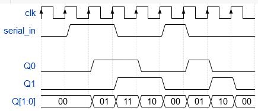
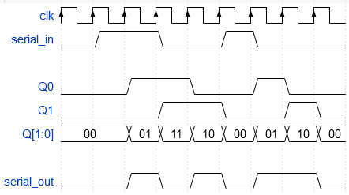
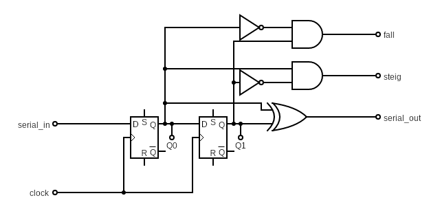
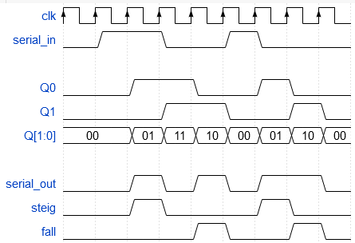
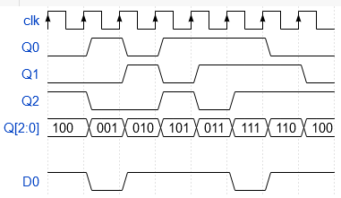

# Praktikum 2: Sequentielle Logik

## Aufgabe 1

- a)

  

  in code:

  ```
  {signal: [
    {name: 'clk', wave: 'P........'},
    {name: 'serial_in', wave: '01.0.10..'},
    {},
    {name: 'Q0', wave: '0.1.0.10.'},
    {name: 'Q1', wave: '0..1.0.10'},
    {name: 'Q[1:0]', wave: '=.=======', data: ['00', '01', '11', '10', '00', '01', '10', '00']},
  ]}
  ```

- b)

  

  in code:

  ```
  {signal: [
    {name: 'clk', wave: 'P........'},
    {name: 'serial_in', wave: '01.0.10..'},
    {},
    {name: 'Q0', wave: '0.1.0.10.'},
    {name: 'Q1', wave: '0..1.0.10'},
    {name: 'Q[1:0]', wave: '=.=======', data: ['00', '01', '11', '10', '00', '01', '10', '00']},
    {},
    {name: 'serial_out', wave: '0.10101.0'},
  ]}
  ```

- c) Es werden sowohl die steigenen wie auch die fallended Flanken erkannt. Es wird `serial_in` zeitverzögert in zwei flip-flops "gespeichert" und miteinander verglichen. Wenn ein Unterscheid erkannt wird, heisst es, dass eine Flanke erkannt wurde.

- d) Keine Ahnung.

- e)

  

- f)

  

  in code:

  ```
  {signal: [
    {name: 'clk', wave: 'P........'},
    {name: 'serial_in', wave: '01.0.10..'},
    {},
    {name: 'Q0', wave: '0.1.0.10.'},
    {name: 'Q1', wave: '0..1.0.10'},
    {name: 'Q[1:0]', wave: '=.=======', data: ['00', '01', '11', '10', '00', '01', '10', '00']},
    {},
    {name: 'serial_out', wave: '0.10101.0'},
    {name: 'steig', wave: '0.10..10.'},
    {name: 'fall', wave: '0...10.10'},
  ]}
  ```

## Aufgabe 2

- a)

  |Q0|Q1|Q2|D0|
  |- |- |- |- |
  |0 |0 |1 |1 |
  |1 |0 |0 |0 |
  |0 |1 |0 |1 |
  |1 |0 |1 |1 |
  |1 |1 |0 |1 |
  |1 |1 |1 |0 |
  |0 |1 |1 |0 |

- b)

  

  in code:

  ```
  {signal: [
    {name: 'clk', wave: 'P.......'},
    {name: 'Q0', wave: '0101..0.'},
    {name: 'Q1', wave: '0.101..0'},
    {name: 'Q2', wave: '10.101..'},
    {name: 'Q[2:0]', wave: '========', data: ['100', '001', '010', '101', '011', '111', '110', '100']},
    {},
    {name: 'D0', wave: '101..01.'},
  ]}
  ```

- c)

:::mermaid
stateDiagram-v2
  4/100 --> 1/001
  1/001 --> 2/010
  2/010 --> 5/101
  5/101 --> 3/011
  3/011 --> 7/111
  7/111 --> 6/110
  6/110 --> 4/100
:::

- d) Es würde gar nichts passieren.
