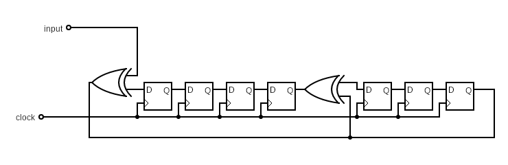

# Praktikum 11: Fehlererkennung mit CRC

## 1.

### a)

<ins>10011</ins>

### b)

u = 0xb1d = 0d2845 = 0b101100011101

```
1011000111010000 / 10011
10011
_010100111010000
__10100111010000
  10011
___0111111010000
____111111010000
    10011
_____11001010000
     10011
______1010010000
      10011
_______011110000
________11110000
        10011
_________1101000
         10011
__________100100
          10011
___________00010
____________0010
```

<ins>c = 0b1011000111010010 = 0xb1d2</ins>

### c)

```
1011000111010010 / 10011
10011
_010100111010010
__10100111010010
  10011
___0111111010010
____111111010010
    10011
_____11001010010
     10011
______1010010010
      10011
_______011110010
________11110010
        10011
_________1101010
         10011
__________100110
          10011
___________00000
____________0000
```

<ins>✔️</ins>

## 2.

1011000111010010 => 1011000111001110

### a)

```
1011000111001110 / 10011
10011
_010100111001110
__10100111001110
  10011
___0111111001110
____111111001110
    10011
_____11001001110
     10011
______1010001110
      10011
_______011101110
________11101110
        10011
_________1110110
         10011
__________111010
          10011
___________11100
           10011
____________1111
```

<ins>Rest = 1111 -> fehlerhafte Übertragung</ins>

### b)

```
10011 * 10 (2) =

 00000
10011.
------
100110
```

```
10011 * 11 (3) =

 10011
10011.
------
110101
```

```
10011 * 100 (4) =

  00000
 00000.
10011..
-------
1001100
```

```
10011 * 101 (5) =

  10011
 00000.
10011..
-------
1011111
```

```
10011 * 110 (6) =

  00000
 10011.
10011..
-------
1101010
```

```
10011 * 111 (7) =

  10011
 10011.
10011..
-------
1110001
```

```
10011 * 1000 (8) =

   00000
  00000.
 00000..
10011...
--------
10011000
```

```
10011 * 1001 (9) =

   10011
  00000.
 00000..
10011...
--------
10001011
```

```
10011 * 1010 (10) =

   00000
  10011.
 00000..
10011...
--------
10111110
```

```
10011 * 1011 (11) =

   10011
  10011.
 00000..
10011...
--------
10101101
```

```
10011 * 1100 (12) =

   00000
  00000.
 10011..
10011...
--------
11110100
```

```
10011 * 1101 (13) =

   10011
  00000.
 10011..
10011...
--------
11000111
```


```
10011 * 1110 (14) =

   00000
  10011.
 10011..
10011...
--------
11110010
```

```
10011 * 1111 (15) =

   10011
  10011.
 10011..
10011...
--------
11100001
```

```
10011 * 10000 (16) =

    00000
   00000.
  00000..
 00000...
10011....
---------
100110000
```

```
10011 * 10001 (17) =

    10011
   00000.
  00000..
 00000...
10011....
---------
100100011
```

```
10011 * 10010 (18) =

    00000
   10011.
  00000..
 00000...
10011....
---------
100010110
```

```
10011 * 10011 (19) =

    10011
   10011.
  00000..
 00000...
10011....
---------
100000101
```

### c)

```
1011000111010010
   100000101
1010000110000010
```

```
1010000110000010 / 10011
10011
_011100110000010
__11100110000010
  10011
___1111110000010
   10011
____110010000010
    10011
_____10100000010
     10011
______0111000010
_______111000010
       10011
________11110010
        10011
_________1101010
         10011
__________100110
          10011
___________00000
____________0000
```

<ins>Fehler nicht erkannt</ins>

## 3.

### a)

CRC-5-ITU: `110101`

CRC-7: `10001001`

<ins>CRC-7</ins>

### b)



### c)

```
100110100 / 10001001
10001001
_00100110
__0100110
```

<ins>0100110</ins>
