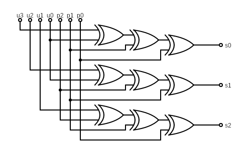
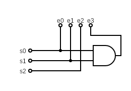
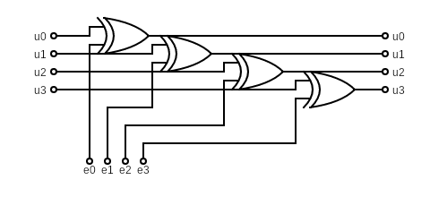

# Praktikum 12: Block-Codes

Fragen:
- Werden an der Prüfung auch Aufgaben wie 12. Praktikum 4. a) und b) kommen, wo a) auf b) aufbaut?
- Wenn in der Generatorenmatrix die Einheitsmatrix rechts ist, kann man dann zur Erstellung der Parity-Check-Matrix einfach eine Einheitsmatrix oben hinstellen?
- Sind Blockcodes und Faltungscodes verschiedene Arten von Kanalcodierung welche Hammingcodes produzieren?
- Weshalb sind die Eigenschaften von Codeworten (systematisch, linear, zyklisch) wichtig?
- Wie würde ein Galoi Feld (10) aussehen? Und weshalb gibt es keinen "overflow"?
- Wo werden in der Praxis was für Codes verwended? Und gibt es noch weitere?
- Fehler in den Folien (Blockcodes)?

❌✔️

## 1.

### a)

```
            110010000000000 0
            101001000000000 0
            100100100000000 1
            011000010000000 0
            010100001000000 0
            001100000100000 1
            111000000010000 0
            110100000001000 0
            101100000000100 0
            011100000000010 1
            111100000000001 1
            ---------------
00100100011|001000100100011.
```

$\boxed{001000100100011}$

### b)

```
11100011101
10011011011
01010110111
00101101111
```

$$
\boxed{
\begin{matrix}
  1 & 0 & 0 & 0 & 1 & 1 & 1 & 0 & 0 & 0 & 1 & 1 & 1 & 0 & 1 \\
  0 & 1 & 0 & 0 & 1 & 0 & 0 & 1 & 1 & 0 & 1 & 1 & 0 & 1 & 1 \\
  0 & 0 & 1 & 0 & 0 & 1 & 0 & 1 & 0 & 1 & 1 & 0 & 1 & 1 & 1 \\
  0 & 0 & 0 & 1 & 0 & 0 & 1 & 0 & 1 & 1 & 0 & 1 & 1 & 1 & 1
\end{matrix}
}
$$

### c)

Erwartung: $1111$ <- stimmt nicht da es ein **gültiges** Codewort ist.

$$
\boxed{
\begin{matrix}
  1 & 0 & 0 & 0 \\
  0 & 1 & 0 & 0 \\
  0 & 0 & 1 & 0 \\
  0 & 0 & 0 & 1 \\
  1 & 1 & 0 & 0 \\
  1 & 0 & 1 & 0 \\
  1 & 0 & 0 & 1 \\
  0 & 1 & 1 & 0 \\
  0 & 1 & 0 & 1 \\
  0 & 0 & 1 & 1 \\
  1 & 1 & 1 & 0 \\
  1 & 1 & 0 & 1 \\
  1 & 0 & 1 & 1 \\
  0 & 1 & 1 & 1 \\
  1 & 1 & 1 & 1 \\
\end{matrix}
}
$$

Resultat: $\boxed{0000}$

### d)

```
                1000 0
                0100 0
                0010 1
                0001 0
                1100 0
                1010 0
                1001 1
                0110 0
                0101 0
                0011 1
                1110 0
                1101 0
                1011 0
                0111 1
                1111 1
                ----
001000100100011|0000
```

$\boxed{0000}$

### e)

Es ist ein gültiges Codewort oder es hat einen undetektierbaren Fehler.

### f)

```
                1000 1
                0100 0
                0010 0
                0001 0
                1100 0
                1010 0
                1001 0
                0110 0
                0101 1
                0011 1
                1110 0
                1101 0
                1011 1
                0111 0 <-
                1111 0
                ----
100000001100100|0111
```

Es hat einen Fehler an der 14. Stelle. Das korrigierte Codewort: $100000001100110$. Das dazugehörige Nutzwort: $00001100110$.

## 2.

### a)

Linear:\
$111 \oplus 111 = 000$\
$000 \oplus 000 = 111$\
$000 \oplus 111 = 111$\
$111 \oplus 000 = 111$

Systematisch:\
1 ist 111 enthalten.\
0 ist 000 enthalten.

### b)

$$
\begin{bmatrix}
  1 & 0 & 1 \\
\end{bmatrix}
$$

### c)

$$
\begin{bmatrix}
  1 \\
  0 \\
  1
\end{bmatrix}
$$

### d)

|$j$|$e_j$|$s_j$|
|:-:|:-:|:-:|
|$0$|$(000)$|$(0)$|
|$1$|$(100)$|$(1)$|

### e)

```
    1
    0
    1
    -
110|1
```

## 3.

### a)

(8, x) linear, systematic code

$\boxed{N = 8}$

$K$ ist beschränkt frei wählbar.

$\boxed{K = 2}$

$$
\boxed{
\begin{matrix}
  0 & 0 & 1 & 0 & 1 & 0 & 1 & 0 \\
  1 & 1 & 0 & 0 & 0 & 0 & 0 & 1
\end{matrix}
}
$$

$d_{min} = 5$

### b)

$$\boxed{4}$$

### c)

$$\boxed{2}$$

### d)

$$\boxed{4}$$

### e)

$$\boxed{4?}$$

## 4.

### a)

Nur, wenn die Anzahl der Codebits grösser als ${4 \over 7}$ ist.

$$
\begin{align*}
  {4 \over 7} &= {K \over 7} \\
  \Rightarrow K &= 4
\end{align*}
$$

$$
\begin{align*}
  {4 \over 7} &= {K \over 21} \\
  \Rightarrow K &= 12
\end{align*}
$$

### b)

$$P_{0,N} = (1 - \varepsilon)^N$$

|$N$|$K$|$t$|$P_N$|$P_{1200}$||$d_{\text{min}}$|
|:-:|:-:|:-:|:-:|:-:|:-:|:-:|
|$7$|$4$|$1$|$(1 - 0.01)^7 = 0.932$|$(1 - 0.01)^{1200 + ({1200 \over 4} \cdot 3)} = 6.822-\text{e}10$||$3$|
|$21$|$12$|$2$|$(1 - 0.01)^{21} = 0.8097$|$(1 - 0.01)^{1200 + ({1200 \over 12} \cdot (21 - 12))} = 6.822-\text{e}10$||$5$|

### c)

Kleinere Codeworte sind besser geschützt?

## 5.

### a)



### b)

|$j$|$e_j$|$s_j$|
|:-:|:-:|:-:|
|$0$|$(0000000)$|$(000)$|
|$1$|$(1000000)$|$(100)$|
|$2$|$(0100000)$|$(010)$|
|$3$|$(0010000)$|$(001)$|
|$4$|$(0001000)$|$(110)$|
|$5$|$(0000100)$|$(011)$|
|$6$|$(0000010)$|$(111)$|
|$7$|$(0000001)$|$(101)$|

$$
\begin{align*}
  000 &\Rightarrow 0000 \\
  100 &\Rightarrow 1000 \\
  010 &\Rightarrow 0100 \\
  001 &\Rightarrow 0010 \\
  110 &\Rightarrow 0001
\end{align*}
$$

|$s_0$|$s_1$|$s_2$||$e_0$|$e_1$|$e_2$|$e_3$|
|:-:|:-:|:-:|:-:|:-:|:-:|:-:|:-:|
|0|0|0||0|0|0|0|
|1|0|0||1|0|0|0|
|0|1|0||0|1|0|0|
|0|0|1||0|0|1|0|
|1|1|0||0|0|0|1|

$e_0$ = $s_0$\
$e_1$ = $s_1$\
$e_2$ = $s_2$\
$e_3$ = $s_0$ & $s_1$



### c)

|input_a|input_b|output|
|:-:|:-:|:-:|
|0|1|1|
|0|0|0|
|1|0|1|
|1|1|0|


