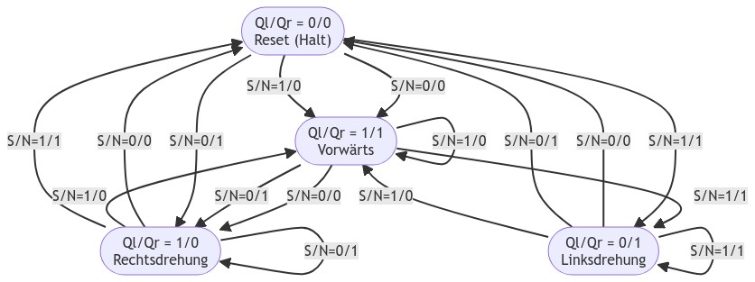

# Praktikum 3: Maus-Roboter

- a)

  

- b)

  |Nr| |Ql|Qr|S|N| |Dl|Dr| |
  |- |-|- |- |-|-|-|- |- |-|
  |0 | |0 |0 |0|0| |1 |1 | |
  |1 | |0 |0 |0|1| |1 |0 | |
  |2 | |0 |0 |1|0| |1 |1 | |
  |3 | |0 |0 |1|1| |0 |1 | |
  |  | |  |  | | | |  |  | |
  |4 | |0 |1 |0|0| |0 |0 | |
  |5 | |0 |1 |0|1| |0 |0 | |
  |6 | |0 |1 |1|0| |1 |1 | |
  |7 | |0 |1 |1|1| |0 |1 | |
  |  | |  |  | | | |  |  | |
  |8 | |1 |0 |0|0| |0 |0 | |
  |9 | |1 |0 |0|1| |1 |0 | |
  |10| |1 |0 |1|0| |1 |1 | |
  |11| |1 |0 |1|1| |0 |0 | |
  |  | |  |  | | | |  |  | |
  |12| |1 |1 |0|0| |1 |0 | |
  |13| |1 |1 |0|1| |1 |0 | |
  |14| |1 |1 |1|0| |1 |1 | |
  |15| |1 |1 |1|1| |0 |1 | |

- c)

  DL = (!QL & !QR & !S & !N) # (!QL & !QR & !S & N) # (!QL & !QR & S & !N) # (!QL & QR & S & !N) # (QL & !QR & !S & N) # (QL & !QR & S & !N) # (QL & QR & !S & !N) # (QL & QR & !S & N) # (QL & QR & S & !N)

  DR = (!QL & !QR & !S & !N) # (!QL & !QR & S & !N) # (!QL & !QR & S & N) # (!QL & QR & S & !N) # (!QL & QR & S & N) # (QL & !QR & S & !N) # (QL & QR & S & !N) # (QL & QR & S & N)

- d) :heavy_check_mark:

- e)

  DL = (!N & S) # (!QL & !QR & !S) # (QL & QR & !S) # (N & !QR & !S)

  DR = (!N & !QL & !QR) # (!QL & S) # (!N & S) # (QR & S)

  :heavy_check_mark:
