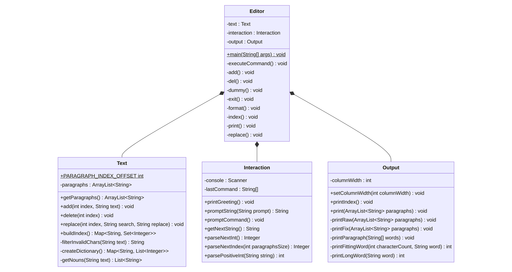

# Team Rocket's NeoVEmacs

The world's most advanced, feature-deprived text editor.

## Requirements
- Java 17

## Build and run commands
- Step 1: Make sure that your `java` and `javac` commands are in your path environment variable so that they can be invoked through a terminal.
- Step 2: Open a terminal/console in the directory of this README.md
- Step 3: Create a folder called `out` by typing
  ```shell
  mkdir out && cd out
  ```
- Step 4: compile the code to `.class` files by typing
  ```shell
  javac -d . ../src/*
  ```
- Step 5: run the compiled code by typing
  ```shell
  java Editor
  ```

## Class diagram


